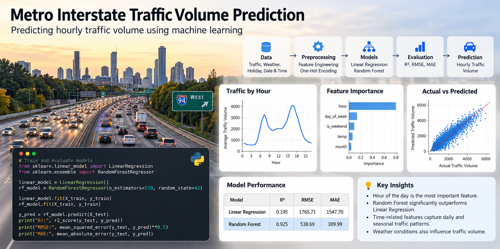

# Metro Traffic Volume Regression

A machine learning regression project focused on analyzing and predicting **metro traffic volume** from structured traffic data.

The project demonstrates a typical data science workflow, including data exploration, preprocessing, regression modeling, prediction, evaluation, and visualization.

## Project Objective

The objective of this project is to build a regression-based machine learning workflow for predicting traffic volume.

Traffic forecasting can support applications such as:

- Transportation planning
- Traffic management
- Infrastructure optimization
- Congestion analysis
- Data-driven mobility planning

## Project Workflow

The notebook follows a structured machine learning workflow:

```text
Traffic Dataset
      ↓
Data Exploration
      ↓
Data Cleaning & Preprocessing
      ↓
Feature Preparation
      ↓
Regression Modeling
      ↓
Prediction
      ↓
Model Evaluation
      ↓
Visualization
```

## Key Tasks

The project includes:

- Loading and inspecting the dataset
- Exploratory Data Analysis (EDA)
- Preparing data for regression
- Training a regression model
- Generating traffic volume predictions
- Comparing predicted and actual values
- Evaluating model performance
- Visualizing regression results

## Visualization

The repository includes a visualization of the regression results:



The visualization provides a graphical comparison of the model output and traffic volume behavior.

## Technologies

- Python
- Jupyter Notebook
- Data Analysis
- Machine Learning
- Regression
- Data Visualization

## Project Files

```text
metro-traffic-volume-regression/
│
├── metro_traffic_volume_regression.ipynb
├── metro_traffic_regression.png
└── README.md
```

### `metro_traffic_volume_regression.ipynb`

Contains the complete data analysis and machine learning workflow.

### `metro_traffic_regression.png`

Visualization generated from the regression analysis.

## Machine Learning Task

**Problem Type:** Regression

The model is trained to predict a continuous numerical value representing traffic volume.

In a regression problem, the goal is not to classify data into categories, but to estimate a numerical target value based on the available input features.

## Project Purpose

This project demonstrates practical experience with:

- Regression analysis
- Machine learning workflows
- Exploratory data analysis
- Data preprocessing
- Model training and prediction
- Model evaluation
- Data visualization
- Jupyter Notebook development

The project was developed for educational, demonstration, and portfolio purposes.
